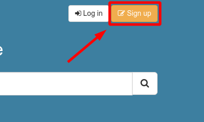
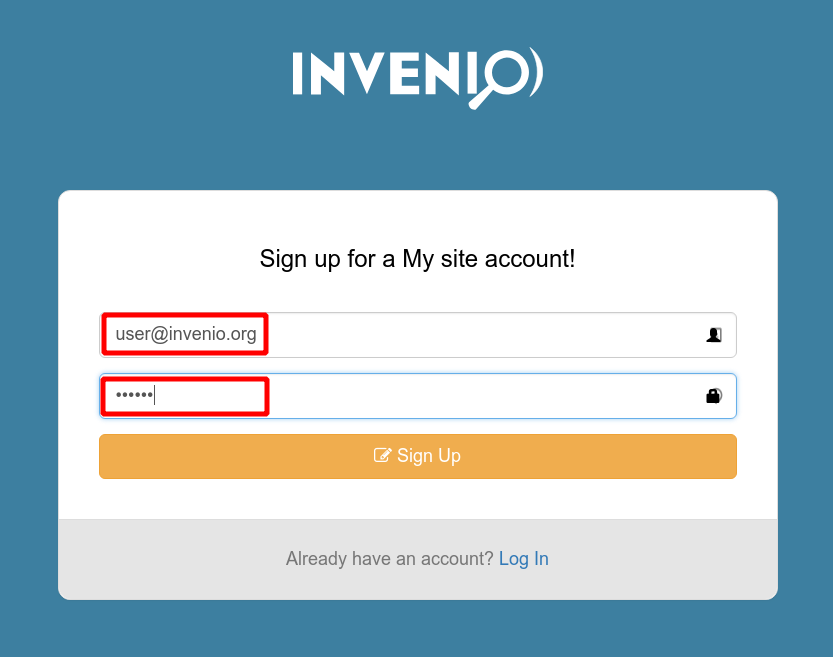
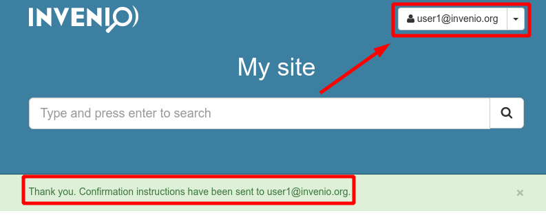
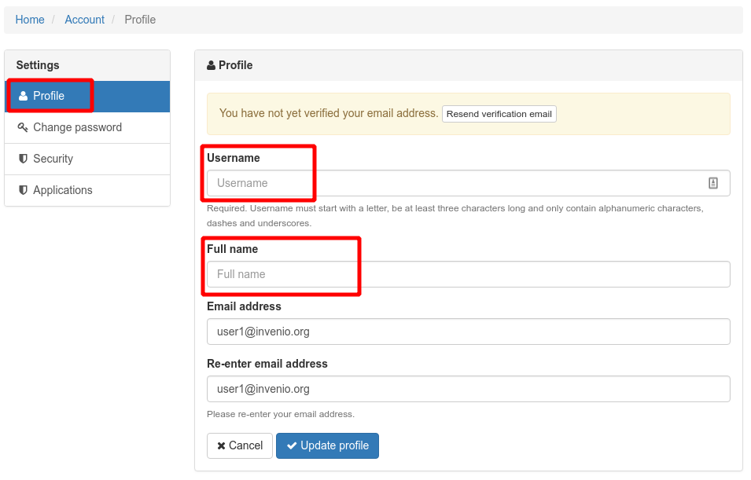
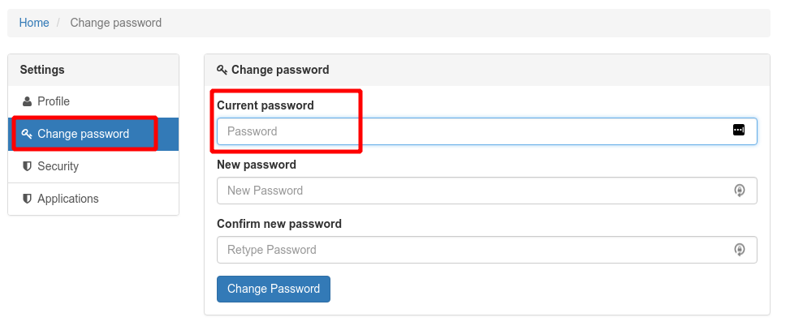

# Tutorial 02 - Tour of Invenio

In this tutorial, we will explore Invenio from a user's perspective. We will
see the different parts of the user interface, explore the REST API and create
and search for records.

## Step 1: Prerequisites

First ensure you have initialized your Invenio instance according to [the
previous tutorial](../01-gettings-started), that you are running the
development server and that you have your browser open at the web application's
frontpage.

## Step 2: Register a user

First thing we need to do is register a user. Click on the "Sign-up" button, at
the top right of the page:



You will be redirected to the user registration form, where you should fill-in
an email address and password:



You will then be redirected to the frontpage, now being logged-in as the user
you registered. A verification email will be sent to the address you provided:



**Note:** The email with the confifmration link is not actually being sent
since we are running a development server. You will see the body of the email
being output in the terminal logs of the web app.

## Step 3: Go through the account settings

Now that you have created a user, let's have a look at the available settings
pages for the user. If you click at your user's email address you will be
redirected to the User Profile page. Here you can set things like a username
or the full name of the user, or change the account's email address.



On the left side of the page, you can see the other settings pages listed. The
"Change password", as you would expect is a page where you can change your
account's password:



The "Security" page is where you can see a list all of the logged-in sessions
for the account. You can see there information about the IP address, browser
and other information about each session. You can also force a "Logout" of an
active session, for security purposes:


Last, but not least, the "Applicatons" settings page, is where you can manage
access tokens used to authenticate your user for REST API access. This is also
the place where you can manage your own OAuth applications to implement
integrations with your Invenio instance:


## Step 4: Access the records REST API

Your new instance exposes a REST API for performing CRUD operations on records
(we will discuss in detail what a "record" is in later sessions).

Let's create a record with some minimal metadata by perfomring a POST request
to the `/api/records/` endpoint with a JSON payload:

```bash
$ curl -i -k --header "Content-Type: application/json" \
    --request POST \
    --data '{"title": "Some title", "contributors": [{"name": "Doe, John"}]}' \
    https://localhost:5000/api/records/?prettyprint=1

HTTP/1.0 201 CREATED
Content-Type: application/json
Content-Length: 341
ETag: "0"
Last-Modified: Fri, 15 Mar 2019 12:25:08 GMT
Link: <https://localhost:5000/api/records/1>; rel="self"
location: https://localhost:5000/api/records/1
X-Frame-Options: sameorigin
X-XSS-Protection: 1; mode=block
X-Content-Type-Options: nosniff
Content-Security-Policy: default-src 'self'; object-src 'none'
X-Content-Security-Policy: default-src 'self'; object-src 'none'
Strict-Transport-Security: max-age=31556926; includeSubDomains
Referrer-Policy: strict-origin-when-cross-origin
X-RateLimit-Limit: 5000
X-RateLimit-Remaining: 4998
X-RateLimit-Reset: 1552656140
Retry-After: 3431
Server: Werkzeug/0.14.1 Python/3.6.7
Date: Fri, 15 Mar 2019 12:25:08 GMT

{
  "created": "2019-03-15T12:22:19.497592+00:00",
  "id": "1",
  "links": {"self": "https://localhost:5000/api/records/1"},
  "metadata": {
    "contributors": [{"name": "Doe, John"}],
    "id": "1",
    "title": "Some title"
  },
  "revision": 0,
  "updated": "2019-03-15T12:22:19.497596+00:00"
}
```

We can retrieve this record by making a `GET /api/records/1` request:

```bash
$ curl -k https://localhost:5000/api/records/1?prettyprint=1

{
  "created": "2019-03-15T12:22:19.497592+00:00",
  "id": "1",
  "links": {"self": "https://localhost:5000/api/records/1"},
  "metadata": {
    "contributors": [{"name": "Doe, John"}],
    "id": "1",
    "title": "Some title"
  },
  "revision": 0,
  "updated": "2019-03-15T12:22:19.497596+00:00"
}
```

**Note:** By default this API doesn't require any authentication. We will
address this in later sessions.

## Step 4: Access the records REST API
